

# Door knock sensor Using ADCC

In this project I use a piezoelectric transducer to sense the vibration of the door surface when someone koncks, or tries to break the door. The transducer is connected directly to an analog input pin of the PIC16F18446, and read using the Analog-to-Digital Converter with Computation (ADCC) peripheral. The PIC does the signal acquisition and processing, and generates a door bell like sound when it detects a door knock, and an alarm sound when it detects a door break attempt. The sound output is produced by another piezoelectric transducer (buzzer), which is connected directly to GPIO pins of the PIC.

## Related Documentation
- [PIC16F18446 Product Family Page](https://www.microchip.com/design-centers/8-bit/pic-mcus/device-selection/pic16f18446)
- [PIC16F18446 datasheet](http://ww1.microchip.com/downloads/en/DeviceDoc/40001985B.pdf) for more information or specifications.

## Software Used

- MPLAB® X IDE 5.30 or newer [(microchip.com/mplab/mplab-x-ide)](http://www.microchip.com/mplab/mplab-x-ide)
- MPLAB® XC8 2.10 or newer compiler [(microchip.com/mplab/compilers)](http://www.microchip.com/mplab/compilers)
- MPLAB® Code Configurator (MCC) 3.95 or newer [(microchip.com/mplab/mplab-code-configurator)](https://www.microchip.com/mplab/mplab-code-configurator)
- MPLAB® Code Configurator (MCC) PIC10/PIC12/PIC16/PIC18 library v1.79 or newer [(microchip.com/mplab/mplab-code-configurator)](https://www.microchip.com/mplab/mplab-code-configurator)

## Hardware Used

- PIC16F18446 Curiosity Nano [DM164144](https://www.microchip.com/Developmenttools/ProductDetails/DM164144)
- Curiosity Nano Base for Click boards™ [AC164162](https://www.microchip.com/developmenttools/ProductDetails/AC164162)
- MikroElektronika™ PROTO Click board™ with a buzzer [MIKROE-1507](https://www.mikroe.com/proto-click)
- MikroElektronika™ PROTO Click board™ with a custom transducer element [MIKROE-1507](https://www.mikroe.com/proto-click)

## Setup

In this demo,

- A PIC16F18446 Curiosity Nano is used to read the piezoelectric transducer, using the ADCC
- A Curiosity Nano Adapter board is used as it has three mikroBUS slots for MikroElektronika™ click boards (this project uses slots 1 and 2)
- A second piezoelectric transducer (buzzer) is used for making output sound (door bell / alarm).

 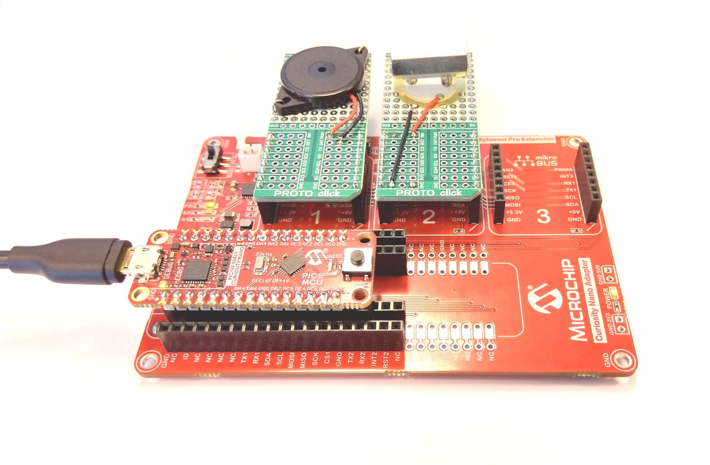

### Demo Hardware Setup

- Build the piezoelectric transducer (sensor) click board, by soldering the transducer element onto a PROTO click board. Connect the outer disc to GND, and the inner disc to the AN pin of the click. Mount a weight on the other side of the transducer, in order to increase its mechanical inertia and make it more sensible. Solder a 1 MegaOhm resistor in parallel to the transducer, to keep it discharged.

 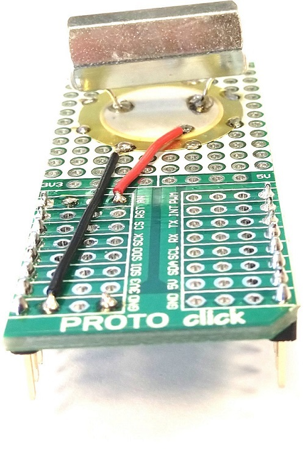

- Plug the piezoelectric transducer (sensor) PROTO click into the mikroBUS slot 2 of the Curiosity Nano Adapter board
- Build the piezoelectric transducer (buzzer) click board, by mounting the buzzer on a PROTO click board from MikroElektronika™, so that it can be plugged into a mikroBUS slot of the Curiosity Nano Adapter board. Connect the buzzer terminals to the PWM and INT pins of the click board.

 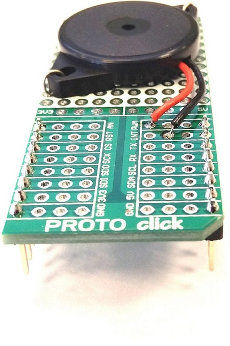

- Plug the piezoelectric transducer (buzzer) PROTO click into the mikroBUS slot 1 of the Curiosity Nano Adapter board
- Solder sockets similar to the ones found on the mikroBUS slots for the Curiosity Nano slot
- Solder pins similar to the ones found on the click boards to the PIC16F18446 CURIOSITY NANO board
- Plug the PIC16F18446 CURIOSITY NANO into its slot on the Curiosity Nano Adapter board (Make sure the mounting holes near to the MicroUSB connector match the ones on the Curiosity Nano Adapter board)

### MCC Settings

This section shows the settings used in the demo/example for various MCU modules configuration. These settings were done using the Microchip Code Configurator (MCC). Open MCC to look at the settings of the modules.

### System Module Settings

The MCU uses the high frequency internal oscillator (HFINTOSC), and the clock is set to 32 MHz. Watchdog Timer is not used in this demo, so it is disabled.

 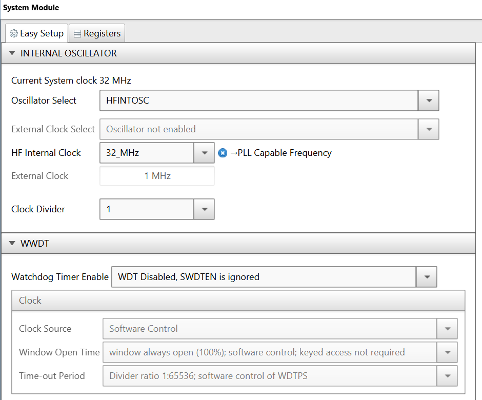

### ADCC Settings

ADCC is used to read the piezoelectric transducer (vibration sensor). It is configured to operate in burst average mode, with the internal RC oscillator as clock source. It also has the Continuous Operation and ADC Threshold Interrupt enabled.

 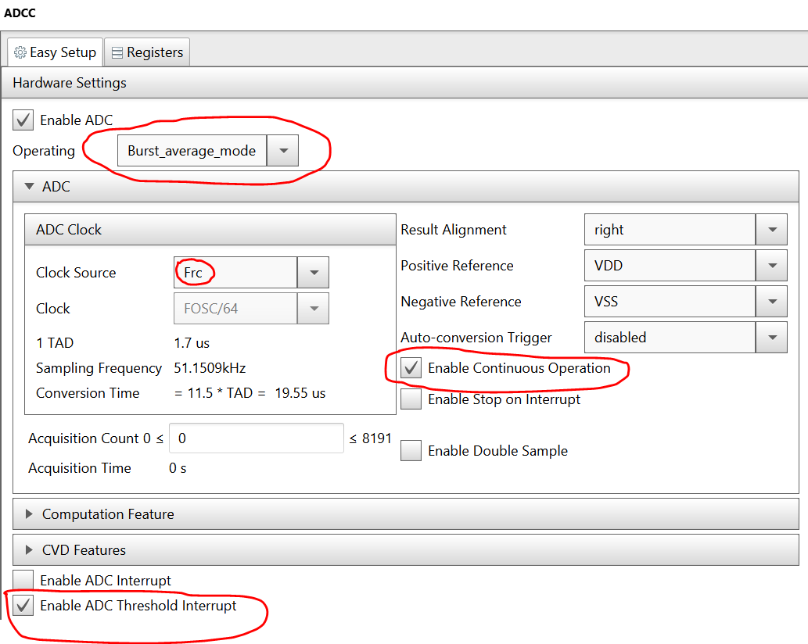

In the ADCC Register section, the computation features in the ADCON3 are set as in the figure below:

 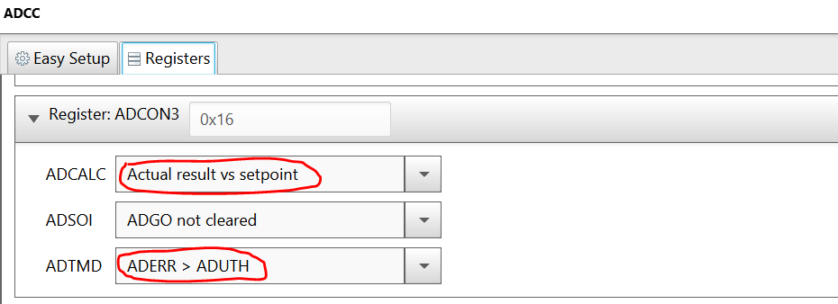

The ADC Setpoint is configured in the ADSTPTL register:

 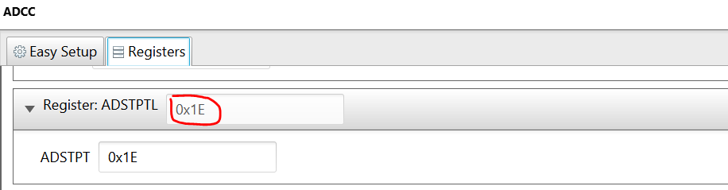

The sample number for the burst average mode is configured in the ADRPT register:

 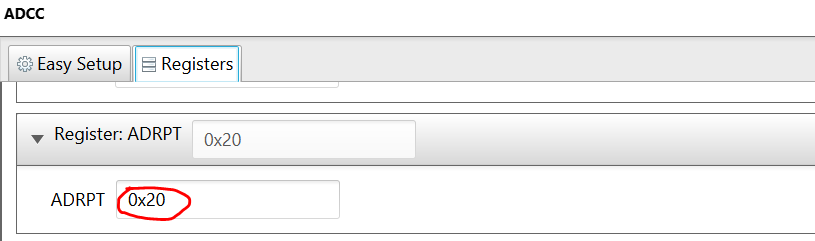

The channel (analog input pin) is configured in the ADPCH register:

 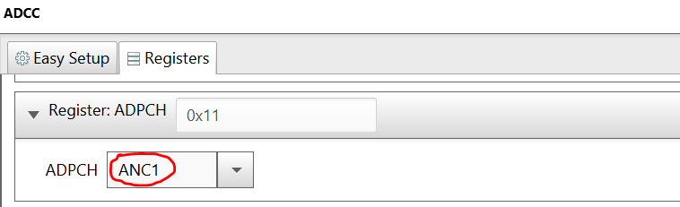

The pin ANC1 corresponds to the AN2 on the Curiosity Nano Adapter board, where the piezoelectric transducer (sensor) is connected.

### TMR1 Settings
Timer 1 is used for generating the 1ms time interval, which is the sample period for the sensor data.

 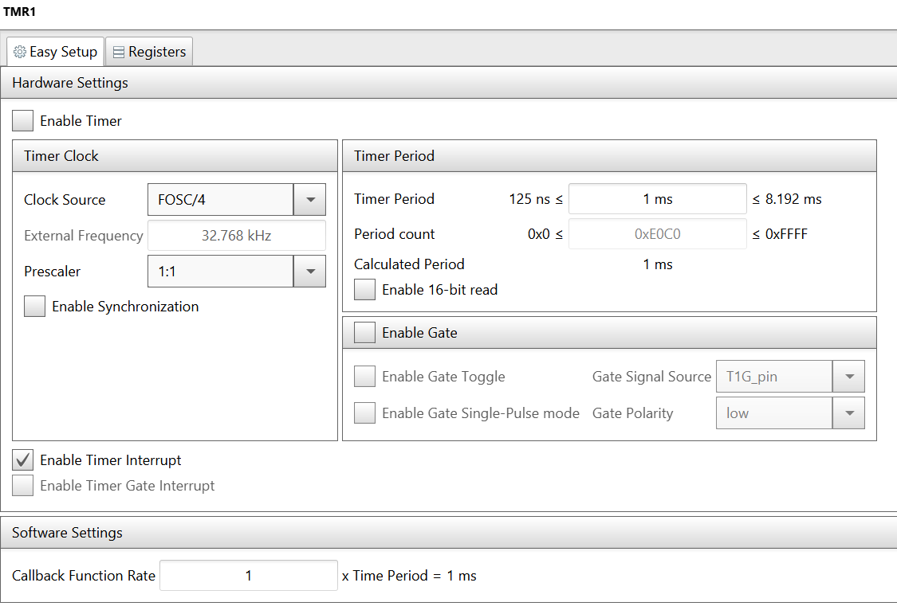

### Pin Manager Settings
The pins are configured as follows:

* Piezoelectric transducer (sensor) is connected to GND and ANC1
* Buzzer is connected to pins RA4 and RC3

 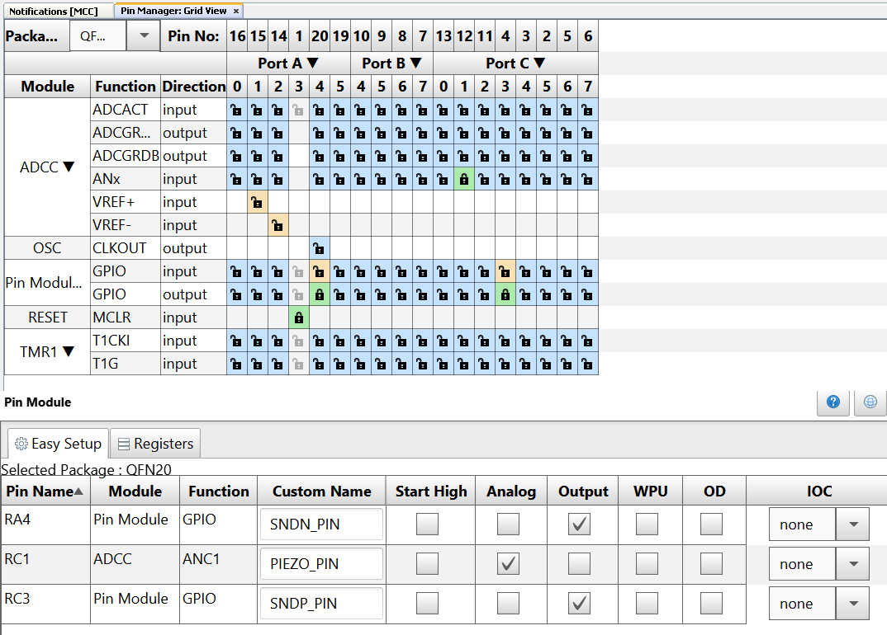

## Demo

1. After making the above hardware connections, connect the PIC16F18446 CURIOSITY NANO board to PC using the USB cable.
2. Build demo firmware and load the generated hex file onto the PIC16F18446 MCU, by dragging the file to the CURIOSITY drive which appears in the file manager when you connect the board to the USB.
3. When the demo firmware is loaded, the buzzer will generate two short beeps, and then the device will wait for an event to happen (door knock or door break attempt).
4. Remove the USB cable.
5. Mount the device onto a door.
6. Power it using an external battery.
7. Knock to the door and you will hear a door bell sound.
8. Hit the door harder and you will hear the alarm.

## Conclusion

This example shows how easy it is to use the PIC16F18446 and MCC to sense a surface vibration using a piezoelectric transducer, and generate a door bell / alarm sound.
